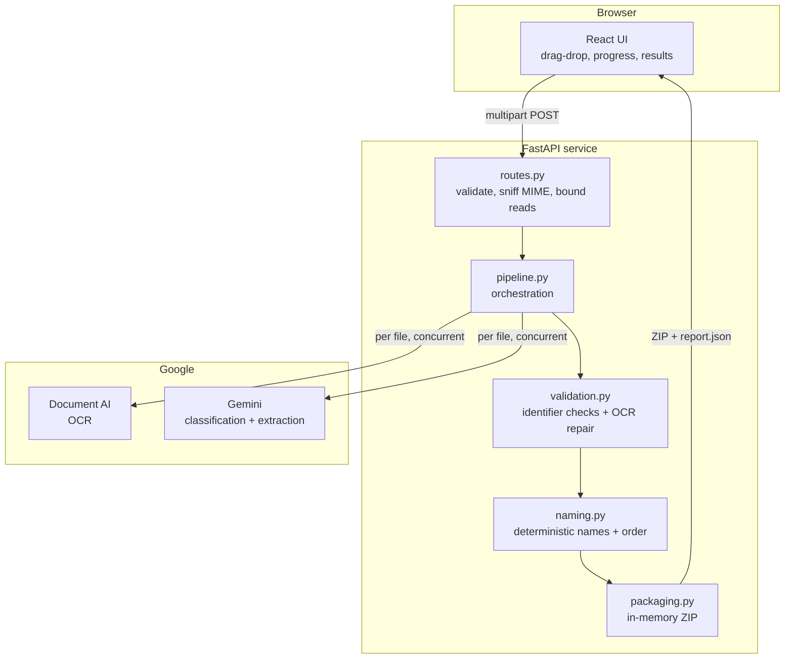

# Candidate Document Processor — Engineering Documentation

End-to-end reference for the system: what it does, how a request travels through
it, what every module is responsible for, and — where it matters — why it was
built this way rather than the obvious alternative.

[`README.md`](README.md) is the shorter operator-facing document (setup, API,
configuration). This one is for whoever has to change the code, review it, or
work out why it did something unexpected at 2am.

**Contents**

1. [The problem](#1-the-problem)
2. [System overview](#2-system-overview)
3. [Request lifecycle](#3-request-lifecycle)
4. [Module reference](#4-module-reference)
5. [Data contracts](#5-data-contracts)
6. [Decision register](#6-decision-register)
7. [Failure taxonomy](#7-failure-taxonomy)
8. [Security and privacy](#8-security-and-privacy)
9. [Performance and cost](#9-performance-and-cost)
10. [Testing strategy](#10-testing-strategy)
11. [Operations](#11-operations)
12. [Extending the system](#12-extending-the-system)
13. [Limitations and roadmap](#13-limitations-and-roadmap)

---

## 1. The problem

A candidate joining a company sends HR a pile of documents — Aadhaar, PAN, a
photograph, payslips, marksheets, offer and relieving letters. They arrive as
`IMG_2931.jpg`, `scan_00042.pdf`, `aaa.pdf`, `234.pdf`, in no order, sometimes
twice, sometimes rotated, sometimes belonging to a different person entirely.

Somebody then renames all of it by hand into a house convention, works out what is
missing, and files it. That is the job being automated.

**What the system guarantees**

- Every delivered file is named to a single deterministic convention.
- Files are ordered as an HR reviewer works through a joining file.
- Anything missing, duplicated, low-confidence, or inconsistent is *reported*,
  never silently resolved.
- No document is written to disk at any point.

**What it explicitly does not do**

- Decide whether a document is genuine.
- Store anything. There is no database, no object store, no candidate record.
- Replace human review on anything it is unsure about.

The last point shapes the whole design. This is a system that files documents and
tells you what it was unsure about, not one that makes judgements on your behalf.

---

## 2. System overview



Three properties are worth noting before reading further.

**The LLM is a reader, not a decision-maker.** Gemini returns a document type and
extracted fields. It does not choose filenames, sort order, or what goes in the
ZIP. Those are computed by code in `app/domain/`, which is why they are
unit-testable and immune to prompt drift.

**Everything is per-request.** No shared state survives a request except the
Document AI gRPC channel and the Gemini client, both of which are stateless
connection pools.

**Degradation is per-file.** A corrupt scan fails alone. The other seven documents
still come back.

---

## 3. Request lifecycle

A trace of one `POST /api/v1/documents/process` from socket to ZIP.

### 3.1 Middleware

`main.py` assigns a request id (honouring an inbound `X-Request-Id` so it can be
correlated with an upstream gateway) and binds it into structlog's context vars.
That id then appears on every log line for the request, in the `X-Request-Id`
response header, and inside `report.json` — one identifier for the whole trace.

### 3.2 Authentication

`api/deps.py` compares the bearer token against `HRDOC_API_TOKENS` using a
constant-time comparison. Empty token list means auth is disabled, which is
allowed outside production and refused at boot inside it.

### 3.3 Upload admission

`routes.py` rejects an empty batch or one exceeding `HRDOC_MAX_FILES_PER_REQUEST`
before reading a single byte.

Each file is then read by `utils/uploads.py` in 64 KB chunks against two budgets:
per-file (`HRDOC_MAX_FILE_BYTES`) and remaining-batch
(`HRDOC_MAX_TOTAL_BYTES`). Chunked reading means a 500 MB upload is refused after
20 MB rather than after the whole body is buffered.

The content type is then **sniffed from magic bytes**, not taken from the request.
The browser-declared type is attacker-controlled and routinely wrong even in
honest use — a phone camera PNG saved as `IMG_2931.jpg`. The sniffed type decides
both admission and the eventual output extension.

Finally, a SHA-256 of the bytes is computed and stored on the upload.

### 3.4 Deduplication

`pipeline._partition_duplicates` groups uploads by digest **before** the batch
fans out. Later copies never reach OCR, so a re-sent attachment costs nothing.
The earliest upload wins, so the kept file is the one HR listed first.

This is byte equality only. Two separate scans of the same PAN card differ in
every pixel and are deliberately *not* caught here — that is a semantic
judgement, and pretending a hash makes it would give the feature false authority.

### 3.5 OCR

`services/ocr.py` calls Document AI's synchronous `processDocument`, bounded by
`HRDOC_OCR_CONCURRENCY`. Three details matter:

- `enable_native_pdf_parsing` uses a PDF's embedded text layer where one exists —
  faster and more accurate than rasterising and re-recognising it.
- `imageless_mode` suppresses page images in the response. We never render the
  document, so returning them would be megabytes of wasted payload per request.
- A **field mask** trims the response to what is actually parsed. It must be
  camelCase (protobuf's `FieldMask` rejects underscores) and may not address more
  than one level under `pages` — both constraints produce an opaque HTTP 400 when
  violated, and both are pinned by tests.

Transient faults retry three times with exponential backoff. `INVALID_ARGUMENT`,
`PERMISSION_DENIED` and `FAILED_PRECONDITION` are not retried; they are
configuration errors, and each is translated into a message naming the fix.

### 3.6 Classification

`services/classifier.py` sends OCR text plus file metadata to Gemini through
LangChain, constrained to the `DocumentClassification` schema via Gemini's native
`json_schema` decoding. That removes the "model wrapped its JSON in prose"
failure mode structurally rather than by parsing defensively.

Two shortcuts avoid a model call:

- **Photograph heuristic.** An image with almost no OCR text is a photograph. It
  is returned at confidence 0.6, not 1.0 — a badly lit scan of an ID card looks
  identical from here, and the modest score routes it to human review.
- **Text budget.** OCR text is truncated to `HRDOC_OCR_TEXT_CHAR_BUDGET` with a
  head-and-tail slice, since document type and key fields cluster at the top and
  bottom. Truncation adds a warning to the file's report entry.

The prompt is built by direct message construction rather than a
`str.format`-based template, because OCR text routinely contains braces — which
is both a crash and a prompt-injection vector.

### 3.7 Identifier validation

Everything the model returns for PAN, Aadhaar and IFSC passes through
`domain/validation.py` before it can influence a filename.

Each format carries structure that OCR does not know about, and that structure is
what makes repair possible rather than speculative:

| Identifier | Structure | Repairs | Rejects |
|---|---|---|---|
| PAN | `AAAAA9999A`, positional | Digit/letter confusions in positions the format fixes | Anything still not matching |
| Aadhaar | 12 digits, Verhoeff check digit, never starts 0/1 | Letters misread for digits | Any checksum failure |
| IFSC | `AAAA0999999`, `0` fixed at position 5 | `O` → `0` at that position | Anything still not matching |

The governing rule: **repair what the format proves, reject what it disproves,
never invent.** A character in a digit-only position can only be a digit, so `I`
there is unambiguously `1` — a correction. But `4` resembling `A` is only a
resemblance; choosing `A` would manufacture a plausible, unverifiable, wrong PAN.
Those are rejected instead.

The asymmetry is deliberate: a rejected identifier costs a filename segment and a
review flag, both recoverable. A wrongly repaired one is silently wrong forever.

Rejected values are cleared from the fields, retained in the warning text so the
page can be found in the original scan, and surfaced in
`report.identifier_warnings`.

### 3.8 Name resolution

Documents disagree about the candidate's name. An Aadhaar says
`RAVI KUMAR SHARMA`, a resume says `Ravi Sharma`, a PAN says `RAVI K`.

`_infer_candidate_name` holds a weighted vote: each document's reading is scored
by classification confidence times the document type's authority for legal names
(identity documents outrank a CV). The winner names the entire batch, so files do
not scatter across several name prefixes.

Voting alone has a blind spot, though: the document that *loses* is exactly the
one worth inspecting, because the usual cause is somebody else's paperwork in the
folder. `_flag_name_mismatches` therefore re-checks every document against the
resolved name and records irreconcilable ones in `report.name_mismatches`.

Compatibility tolerates legitimate variation — abbreviation (`AJAY K` vs
`AJAY KANAGARAJ`), dropped middle names, reordering, diacritics — by requiring
every token of the shorter name to be accounted for in the longer, exactly or as
an initial. `Ajay K` matches `Ajay Kanagaraj`; it does not match `Ajay Sharma`.

### 3.9 Naming and ordering

`domain/naming.py` composes the final name:

```
NN_CandidateName_DocumentType[_Identifier].ext
02_RaviKumarSharma_PAN_ABCDE1234F.pdf
```

- **`NN_` prefix** — ZIP entries carry no intrinsic display order, so every
  extractor and file browser re-sorts alphabetically. The prefix is what makes the
  filing order survive extraction.
- **Extension** — from the sniffed content type, falling back to the uploaded
  suffix only for types with no mapping, and to `.bin` for anything not
  allow-listed. A crafted upload name cannot introduce an executable extension.
- **Identifier** — type-specific: PAN number, masked Aadhaar, `YYYYMM` for a
  payslip, qualification and year for a marksheet, employer and year for
  employment letters. Empty when the type has no natural identifier.
- **Sort key** — canonical type order first, then chronological within a type so a
  run of payslips reads forward, then upload order for stability. Undated
  documents sort last within their group.
- **Collisions** — `deduplicate` appends `-2`, `-3`. Two payslips for the same
  month would otherwise silently overwrite each other inside the ZIP.

### 3.10 Packaging and response

`services/packaging.py` assembles the ZIP in memory. Already-compressed formats
(JPEG, PNG, WEBP, GIF) are stored rather than deflated — re-compressing them
costs CPU and saves essentially nothing. Every entry name is re-checked against
path traversal at this boundary; names are safe by construction, and the assertion
exists so a future change to naming cannot quietly produce a zip-slip payload.

The response streams from the buffer with `Cache-Control: no-store` (it contains
personal data) and three headers the UI reads without unzipping anything:
`X-Request-Id`, `X-Files-Failed`, `X-Needs-Review`.

### 3.11 The browser side

`api/client.ts` receives the ZIP as a Blob and reads **only `report.json`** out of
it with `fflate`, using an entry filter. The alternative — a second endpoint
returning the report as JSON — would mean running OCR and classification twice, or
introducing server-side storage to hold the result between calls. Reading it from
the archive the browser already has costs one small decompression.

---

## 4. Module reference

### Backend — `app/`

| Module | Responsibility | Notes |
|---|---|---|
| `main.py` | App factory, lifespan, middleware, error handlers | Builds engines at startup; injects the system trust store *before* any client exists |
| `config.py` | Settings from env/`.env` | `NoDecode` on list fields; `get_settings` is `lru_cache`d, so `.env` edits need a restart |
| `errors.py` | Typed errors with HTTP status + stable code | `detail` is logged, never returned — it can quote upstream payloads |
| `tls.py` | OS trust store injection | Fixes `CERTIFICATE_VERIFY_FAILED` behind intercepting proxies |
| `logging_config.py` | structlog setup | Includes a processor that scrubs identifiers before they reach a sink |
| `api/routes.py` | Endpoints | Admission checks, bounded reads, streaming response |
| `api/deps.py` | DI: settings, pipeline, auth | Constant-time token comparison |
| `domain/document_types.py` | Taxonomy | Single source of truth: order, hints, required set, sensitivity |
| `domain/schemas.py` | Pydantic contracts | LLM schema and API models |
| `domain/naming.py` | Filenames, ordering, name compatibility | Pure functions, no I/O |
| `domain/validation.py` | Identifier format + checksum + OCR repair | Pure functions, no I/O |
| `services/ocr.py` | Document AI | Lazy client, bounded concurrency, typed error translation |
| `services/classifier.py` | Gemini via LangChain | Constrained decoding, photograph heuristic |
| `services/pipeline.py` | Orchestration | The only module that knows the whole sequence |
| `services/packaging.py` | ZIP assembly | Path-traversal assertion, selective compression |
| `utils/uploads.py` | Bounded reads, MIME sniffing, digest | |
| `utils/redaction.py` | Masking | `mask_identifier` for deliberate output, `redact_text` for logs |

Dependencies point one way: `api → services → domain → utils`. `domain` imports
nothing from `services`, which is what keeps naming and validation testable
without touching the network.

### Frontend — `frontend/src/`

| File | Responsibility |
|---|---|
| `App.tsx` | Layout, wiring |
| `hooks/useDocumentProcessor.ts` | Upload queue, request lifecycle, abort on unmount |
| `api/client.ts` | Multipart POST, typed errors, ZIP reading |
| `components/FileDropzone.tsx` | Drag-drop and file picker |
| `components/FileList.tsx` | Queue with per-file removal |
| `components/ResultPanel.tsx` | Report rendering, download |
| `types.ts` | Mirrors the backend report schema |

Client-side validation duplicates the server's rules on purpose: rejecting a
200 MB video in the browser is instant, where the server can only reject it after
the upload crosses the wire. The server remains the authority.

---

## 5. Data contracts

### What the LLM must return

```jsonc
{
  "document_type": "PAN",          // matched against the taxonomy
  "confidence": 0.98,              // 0.0-1.0, honest low values expected
  "fields": {                      // all optional; "" / 0 mean absent
    "full_name": "Ravi Kumar Sharma",
    "pan_number": "ABCDE1234F"
  },
  "reasoning": "Contains 'Permanent Account Number' and a valid PAN format."
}
```

Absent values are empty strings and zeros rather than `null`. Constrained decoding
against a schema full of `anyOf: [T, null]` branches is measurably more fragile
than one with flat, always-present fields. `as_dict()` strips the sentinels so
nothing downstream knows about this.

Deliberately **not** in the schema: the output filename and sort position. Both
are derived, which is what keeps naming deterministic.

### What the caller gets

```jsonc
{
  "request_id": "…",
  "candidate_name": "Ravi Kumar Sharma",
  "files": [
    {
      "original_filename": "scan_00042.pdf",
      "output_filename": "02_RaviKumarSharma_PAN_ABCDE1234F.pdf",
      "document_type": "PAN",
      "confidence": 0.98,
      "ocr_confidence": null,
      "page_count": 1,
      "extracted_fields": { "pan_number": "ABCDE1234F" },
      "reasoning": "…",
      "warnings": [],
      "error": null,
      "duplicate_of": null
    }
  ],
  "missing_document_types": ["Photograph", "Resume"],
  "duplicate_document_types": [],
  "duplicate_uploads": 1,
  "name_mismatches": [],
  "identifier_warnings": [],
  "needs_review": ["03_RaviKumarSharma_Aadhaar.pdf"],
  "processing_ms": 2703
}
```

`files` is in **upload order** so HR can reconcile against what they sent; the ZIP
is in **filing order**. These are intentionally different.

---

## 6. Decision register

The choices most likely to be questioned, and the reasoning behind them.

**Naming in code, not in the prompt.** Models read documents well and are
inconsistent across a batch. Filenames must be stable, collision-free and
filesystem-safe. Prompt drift can change a classification; it cannot change the
naming scheme.

**Two confidence thresholds.** Below 0.55 a document is filed `Unknown`; between
0.55 and 0.75 it is filed as classified but listed in `needs_review`. One
threshold forces a choice between discarding a usable classification and hiding
uncertainty. A misfiled Aadhaar is worse than one a human glances at.

**No storage, anywhere.** Uploads live in memory for the request. This is what
makes the privacy claim structural rather than dependent on cleanup code running.
It costs the ability to process PDFs over 15 pages (batch Document AI requires GCS
staging) and to offer async job polling. Both were judged worth it.

**Per-file failure isolation.** HR uploading eight documents should not lose seven
because one scan was corrupt.

**Masking is on by default, PAN excepted.** Aadhaar and bank numbers appear as
`XXXXXXXX1234`. PAN is kept whole because it is the identifier HR actually files
against. Logs are scrubbed independently, so an identifier that leaks into a log
call is masked before reaching a sink.

**Dedup by hash before fan-out.** Placement is the whole point: after the fan-out
it would report duplicates having already paid for them.

**System trust store on by default.** Off by default means every corporate-network
install fails on first run with an error that looks like a broken API key.

**Errors return `message`, log `detail`.** Upstream payloads can quote document
content. The stable `code` is what clients branch on.

---

## 7. Failure taxonomy

| Stage | Failure | Behaviour |
|---|---|---|
| Admission | Too many files, oversized, unsupported type | Whole request rejected, 4xx, typed code |
| Admission | Empty file, missing filename | Whole request rejected |
| OCR | Missing credentials | Cached after first attempt; every file fails fast with the fix named |
| OCR | Billing disabled | `FAILED_PRECONDITION` → message pointing at the billing console |
| OCR | >15 pages | Google's message plus the page-limit hint |
| OCR | Transient (503, timeout) | 3 retries, exponential backoff, then per-file failure |
| Classification | TLS interception | Per-file failure; the fix is `HRDOC_USE_SYSTEM_TRUST_STORE` |
| Classification | Malformed output | Retried, then per-file failure |
| Classification | Low confidence | Filed `Unknown` or flagged, never dropped |
| Validation | Identifier fails checksum | Cleared from filename, warned, flagged for review |
| Naming | Filename collision | `-2`, `-3` suffix |
| Batch | Duplicate upload | Skipped, reported, excluded from ZIP |
| Batch | Name mismatch | Reported, flagged, still delivered |

The consistent principle: **a request fails only when the request is wrong.**
Anything wrong with an individual document is reported and the batch continues.

---

## 8. Security and privacy

**Data at rest.** None. No disk writes, no database, no object store. Starlette's
multipart parser would ordinarily spool parts over 1 MB to a temp file, so both
thresholds are raised to the batch cap and oversized uploads are rejected by our
own bounded reader instead.

**Data in transit.** HTTPS to Google. TLS verification is never disabled — behind
an intercepting proxy the OS trust store is used instead, which keeps verification
fully intact.

**Credentials.** Service account key or ADC for Document AI; API key for Gemini.
`.gitignore` ignores root-level JSON outright, because Google names key downloads
`<project-id>-<key-id>.json`, which no sensible wildcard matches.

**Least privilege.** The service account needs only *Document AI API User*.

**Logs.** A structlog processor masks identifiers before they reach a sink, so a
leak into a log call is caught at the boundary rather than relying on every call
site being careful.

**Auth.** Bearer tokens, constant-time comparison, comma-separated for rotation.
Production refuses to boot without them.

**Response caching.** `Cache-Control: no-store`.

**Known weakness.** The frontend token is embedded in the built bundle and
readable by anyone who loads the page. Acceptable behind SSO or a VPN for an
internal tool; a public deployment needs a server-side proxy holding the token.

---

## 9. Performance and cost

**Latency** is dominated by the two API calls. Both fan out concurrently, bounded
by `HRDOC_OCR_CONCURRENCY` and `HRDOC_LLM_CONCURRENCY` (5 each). Observed: ~1–3 s
for a single-page image end to end; ~2.7 s for four documents processed
concurrently.

**Memory** per in-flight request is bounded by `HRDOC_MAX_TOTAL_BYTES` (100 MB
default), because uploads are deliberately kept out of the filesystem. Size worker
count against it — 4 workers × 100 MB is a 400 MB worst case.

**Cost** is per Document AI page plus per Gemini call. Three mechanisms reduce it:

- Duplicate uploads skip both calls entirely.
- The photograph heuristic skips the LLM call for text-free images.
- `imageless_mode` and the field mask cut response size, which reduces
  deserialisation cost rather than API price.

`HRDOC_GEMINI_THINKING_BUDGET` defaults to 0. Raise it only if you observe
systematic misclassification; it directly increases cost per call.

**Scaling.** The service is stateless — scale horizontally. Long batches hold the
request open, so any reverse proxy needs a matching read timeout. If batches
routinely exceed a couple of minutes, the next step is a job queue with a polled
status endpoint, which reintroduces storage and is why it is not here.

---

## 10. Testing strategy

**178 tests**, no network calls, no API spend, no credentials.

| File | Tests | Covers |
|---|---|---|
| `test_pipeline.py` | 34 | Orchestration, ordering, dedup, validation, mismatch, privacy |
| `test_naming.py` | 28 | Filenames, extensions, collisions, sort keys |
| `test_validation.py` | 21 | Verhoeff, PAN/Aadhaar/IFSC, OCR repair |
| `test_api.py` | 17 | HTTP contract, auth, limits, error shapes |
| `test_classifier.py` | 11 | Truncation, heuristic, taxonomy mapping |
| `test_config.py` | 7 | Env and `.env` loading through the real source layer |
| `test_ocr.py` | 6 | Client construction, credential caching, field mask |
| `test_redaction.py` | 5 | Masking |
| `test_name_matching.py` | 4 | Name compatibility both directions |
| `test_tls.py` | 4 | Trust store injection |

Three conventions worth preserving:

**Fakes, not mocks.** `FakeOcrEngine` and `FakeClassifier` implement the real
protocols and return canned results, so tests exercise the actual orchestration
rather than assertions about call arguments.

**Generated fixtures for checksummed values.** Aadhaar test numbers are computed
from the Verhoeff algorithm rather than copied from a real card. Safer, and a
stronger test — a hardcoded number proves one case, round-tripping generated ones
proves the algorithm.

**Test the layer that actually runs.** `test_config.py` exists because every other
test built `Settings(...)` from Python objects and never exercised pydantic's
source layer — where a real `.env` had been failing to load at all.

---

## 11. Operations

### Configuration

Every setting is `HRDOC_`-prefixed except `GOOGLE_APPLICATION_CREDENTIALS`, which
keeps its conventional name. See [`.env.example`](.env.example).

Two traps worth knowing:

- **`.env` is read once per process** (`get_settings` is `lru_cache`d). Editing it
  under a running server changes nothing, and `--reload` does not watch it.
  Restart.
- **`HRDOC_DOCAI_LOCATION` must match the processor's region exactly**, lowercase.
  A mismatch produces a "processor not found" that looks like a bad ID.

### Health

`GET /health` reports which engines are wired up. It checks that IDs are
*present*, not that they authenticate — a misconfigured deployment can report
`google-document-ai` and still fail on first upload. The definitive check is
sending a document through.

### Monitoring

Structured logs (JSON when `HRDOC_LOG_JSON=true`), every line carrying the request
id. Worth alerting on: `pipeline.ocr_failed`, `pipeline.classification_failed`,
`config.problem` at startup, and the ratio of `needs_review` to total files, which
is the leading indicator of classification quality drifting.

### Production boot checks

With `HRDOC_ENVIRONMENT=production` the app refuses to start if Document AI,
Gemini or API tokens are unconfigured, and `/docs` is disabled. You cannot
accidentally deploy this unauthenticated.

---

## 12. Extending the system

**Adding a document type.** Add the member to `DocumentType`, place it in
`CANONICAL_ORDER`, write a `TYPE_HINTS` entry, and add an identifier branch in
`naming.build_identifier` if it needs one. The prompt, the report and the ordering
all read from that one module.

**Adding an extracted field.** Add it to `ExtractedFields` with a description —
the description is what the model sees. Add masking to `_MASKED_REPORT_FIELDS` if
it is sensitive, and a validator in `validation.py` if it has checkable structure.

**Swapping OCR or the LLM.** Both sit behind protocols (`OcrEngine`,
`DocumentClassifier`). Implement the protocol, return it from the corresponding
`build_*` function. The pipeline does not know which implementation it has.

**Adding a validator.** Write a function returning `ValidatedIdentifier` and
register it in `_IDENTIFIER_VALIDATORS`. Follow the existing rule: repair what the
format proves, reject what it disproves, never invent.

---

## 13. Limitations and roadmap

### Measured gaps

**Classification accuracy is unmeasured.** No labelled set of real Indian
documents has been run through this. Before trusting it unsupervised, assemble
50–100 real scans per type and measure per-type precision. The `confidence` values
in `report.json` are what you would calibrate the 0.55 / 0.75 thresholds against.
Everything verified so far used synthetic images, which lack the rotation, glare
and regional layout variation that real scans have.

**No rate limiting.** Each request costs real Document AI and Gemini spend. Put a
limiter at the gateway before exposing this widely.

**`ocr_confidence` is always null.** The OCR processor does not populate per-page
layout confidence. This affects only the low-quality-scan warning, not
classification.

### Known unimplemented behaviour

**Multi-document PDFs.** A single PDF containing an Aadhaar, then a PAN, then a
degree certificate is currently classified as one document and named after
whichever type dominates. This is the largest correctness gap.

It needs no extra OCR spend: Document AI already returns per-page layout with text
anchors, so page text can be derived from the call already being made, classified
per page, grouped into contiguous runs, and split with `pypdf`. It does change the
pipeline's shape from one-file-one-document to one-file-many-documents, which
touches naming, ordering and the report.

**Rules before the LLM.** A regex for "Permanent Account Number" plus a PAN-shaped
string would classify the easy majority without a model call — cheaper, faster and
auditable. The LLM would become the fallback for genuinely ambiguous documents
rather than the first resort.

**Also absent:** encrypted-PDF detection (currently an opaque OCR failure), HEIC
conversion, and per-company grouping for candidates with several employers.

### Semantic duplicates

Two different scans of the same PAN card are not detected as duplicates. Byte
hashing cannot see it. Doing it properly means comparing extracted identifiers —
same type, same PAN number, different bytes — which is a natural extension of the
validation layer now that identifiers are trustworthy.
